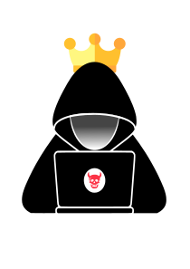

# openkoth

  

Openkoth is a King of The Hill platform written in golang. Customize your on web interface for your tournament or use the default interface that comes with the platform. The platform is powered by a GO API along with a redis server and a MySQL database. Additionally monitor the platform with Prometheus with Grafana. Everything ready to go out of the box.  
